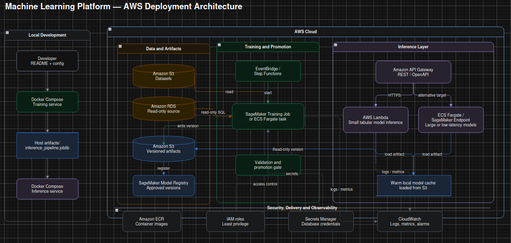

# Machine Learning Platform

A configurable and reproducible platform for training, evaluating, versioning, and serving machine learning models.

The project is organized around three capabilities:

- **Training Capability:** configuration-driven model training and evaluation.
- **Inference Capability:** REST API for predictions from a versioned artifact.
- **Local Infrastructure:** Docker and Docker Compose runtime for training and serving.

The central architectural principle is training-serving consistency: the fitted preprocessing pipeline and estimator are saved together and reused by the inference API.

See the [architecture overview](docs/architecture.md) and the
[deployment diagram](docs/aws-architecture.drawio) for the capability
boundaries, artifact flow, local Docker Compose topology, and proposed AWS
deployment.



The image is optimized for quick review; the editable
[draw.io source](docs/aws-architecture.drawio) is available for deeper inspection.

## Repository structure

```text
.
├── configs/
│   ├── metrics/                 # Default metrics by task
│   └── training/                # Versioned training configurations
├── data/sample/                 # Deterministic, non-sensitive example data
├── artifacts/                   # Generated artifacts; not versioned
├── docker/
│   ├── Dockerfile               # Runtime image
│   └── docker-compose.yml       # Training and inference services
├── docs/
│   ├── architecture.md         # Cloud and application architecture
│   ├── aws-architecture-image.png # Presentation-ready architecture image
│   └── aws-architecture.drawio  # Deployment diagram
├── src/ml_platform/
│   ├── application/            # Training and inference use cases
│   ├── domain/                 # Configuration, errors, and domain models
│   ├── adapters/               # Data sources, artifact stores, and loaders
│   ├── plugins/                # Estimators, preprocessing, validation, metrics
│   └── interfaces/             # CLI and REST API adapters
├── tests/                      # Unit and integration tests
├── pyproject.toml              # Dependencies and package entry points
└── scripts/                    # Reproducible helper scripts
```

## Quick start: end-to-end execution

The complete local flow can be executed with Docker Compose. It trains a
versioned artifact, selects that exact artifact, starts the inference API, and
exposes the interactive Swagger documentation.

Prerequisites:

- Docker Engine;
- Docker Compose v2;
- Python 3.11+ to generate the sample dataset.

From the repository root:

```bash
python3 scripts/generate_sample_data.py
docker compose -f docker/docker-compose.yml build
docker compose -f docker/docker-compose.yml run --rm training
```

Find the run created by training and select it explicitly:

```bash
RUN_ID=$(find artifacts -mindepth 1 -maxdepth 1 -type d -printf '%T@ %f\n' \
  | sort -nr | head -n1 | cut -d' ' -f2-)
export MODEL_ARTIFACT_PATH="/app/artifacts/$RUN_ID"
echo "Using artifact: $RUN_ID"
```

Start inference:

```bash
docker compose -f docker/docker-compose.yml up -d inference
```

Verify the service and send a prediction:

```bash
curl http://127.0.0.1:8000/health
curl http://127.0.0.1:8000/ready
curl -X POST http://127.0.0.1:8000/predict \
  -H 'Content-Type: application/json' \
  -d '{"distance_km":8.5,"prep_minutes":28,"weather":"rain","order_hour":19}'
```

Open the interactive API documentation at
[http://127.0.0.1:8000/docs](http://127.0.0.1:8000/docs). The Swagger UI
contains ready-to-run examples for single and batch predictions, including
success and structured error responses.

## Training Capability

The training capability is configuration-first. A YAML file defines:

- data source;
- problem type and task;
- validation strategy;
- preprocessing;
- algorithm and parameters;
- evaluation metrics;
- artifact location.

The orchestration code does not contain source-specific or algorithm-specific branching. Data sources are adapters and ML behavior is resolved through plugin registries.

### Run training with Docker Compose

Run the one-shot training service:

```bash
docker compose -f docker/docker-compose.yml run --rm training \
  --config /app/configs/training/classification.yaml
```

The command creates a versioned artifact under:

```text
artifacts/<run_id>/
```

### Configure another training run

Create a new YAML file under `configs/training/` so each run remains
reproducible. The main fields to review are:

```yaml
data_source:
  type: csv
  path: data/sample/delivery_classification.csv
target_column: late
task: classification
model:
  algorithm: logistic_regression
  parameters: {}
```

The same configuration also defines validation, preprocessing, metrics, and
the artifact root. Keep the preprocessing section in the training YAML; the
fitted preprocessing steps are saved inside the inference pipeline and are
applied automatically by the API.

For example, to create a separate run with another estimator:

```bash
cp configs/training/classification.yaml configs/training/gbm.yaml
# edit configs/training/gbm.yaml
docker compose -f docker/docker-compose.yml run --rm training \
  --config /app/configs/training/gbm.yaml
```

The built-in estimator names include `logistic_regression`,
`random_forest_classifier`, `linear_regression`, `random_forest_regressor`,
`kmeans`, `isolation_forest`, `xgboost_classifier`, and
`xgboost_regressor`. For a GBM-style classification run, use
`xgboost_classifier` and install the optional dependency locally:

```bash
.venv/bin/pip install -e ".[api,dev,xgboost]"
.venv/bin/ml-platform --config configs/training/gbm.yaml
```

The default Compose image installs the API dependencies only. To run
XGBoost inside Docker, build an image variant with the `xgboost` extra enabled
in `docker/Dockerfile` before starting the training service.

The generated `metadata.json` records the selected algorithm and the
artifact's `config.yaml` records the complete effective configuration.

### Run training locally with Python

```bash
python3 -m venv .venv
.venv/bin/pip install -e ".[api,dev]"
python3 scripts/generate_sample_data.py
.venv/bin/ml-platform --config configs/training/classification.yaml
```

### Metrics behavior

Metrics can be explicitly configured:

```yaml
evaluation:
  metrics:
    - accuracy
    - precision_weighted
    - recall_weighted
    - f1_weighted
    - roc_auc
    - ks
```

If `evaluation.metrics` is omitted, the platform loads task defaults from:

```text
configs/metrics/defaults.yaml
```

The effective metric list is persisted in the artifact configuration.

## Inference Capability

The inference API consumes one immutable training artifact. It does not retrain the model or reimplement preprocessing.

The artifact contains:

```text
artifacts/<run_id>/
├── inference_pipeline.joblib  # fitted preprocessing + estimator
├── schema.json                # feature contract
├── config.yaml                # effective training configuration
├── metadata.json              # version, model, environment, and lineage
└── metrics.json               # validation report
```

### Run the API with Docker Compose

Select the exact artifact version:

```bash
export MODEL_ARTIFACT_PATH=/app/artifacts/<run_id>
```

Start the inference service:

```bash
docker compose -f docker/docker-compose.yml up inference
```

The service exposes:

- Swagger UI: http://localhost:8000/docs
- OpenAPI schema: http://localhost:8000/openapi.json
- Liveness: http://localhost:8000/health
- Readiness: http://localhost:8000/ready

### Make a prediction

Single prediction:

```bash
curl -X POST http://localhost:8000/predict \
  -H 'Content-Type: application/json' \
  -d '{"distance_km":8.5,"prep_minutes":28,"weather":"rain","order_hour":19}'
```

Batch prediction:

```bash
curl -X POST http://localhost:8000/predict/batch \
  -H 'Content-Type: application/json' \
  -d '{"instances":[{"distance_km":8.5,"prep_minutes":28,"weather":"rain","order_hour":19},{"distance_km":2.0,"prep_minutes":12,"weather":"clear","order_hour":11}]}'
```

The API validates the request contract and passes raw feature values to the fitted pipeline. Imputation, encoding, scaling, and model inference are performed by `inference_pipeline.joblib`.

## How to use the platform

The recommended workflow is:

1. Generate or provide the input data.
2. Run the training capability with a versioned YAML configuration.
3. Select the generated artifact directory by its `run_id`.
4. Start the inference service with `MODEL_ARTIFACT_PATH`.
5. Check readiness and send raw features through the REST API.

For the complete command sequence, use the local end-to-end walkthrough
available in the developer workspace. It is intentionally private and ignored
by Git.

The interactive API documentation is available after starting inference:

- Swagger UI: http://localhost:8000/docs
- OpenAPI JSON: http://localhost:8000/openapi.json

Swagger documents the feature request example, success responses, and the
structured error responses returned for invalid requests, prediction failures,
and unavailable artifacts.

## Local infrastructure

Docker Compose defines two independent services:

```text
training
  configs: read-only
  data: read-only
  artifacts: read-write
  lifecycle: one-shot

inference
  artifacts: read-only
  MODEL_ARTIFACT_PATH: explicit version
  port: 8000
  lifecycle: long-running
```

Starting the inference service does not trigger training. A new model version is created by a new training run and selected explicitly through `MODEL_ARTIFACT_PATH`.

## Tests

Run the complete test suite:

```bash
.venv/bin/pytest
```

The tests cover configuration, validation, plugin resolution, evaluation, artifact persistence, API health/readiness, predictions, batch requests, OpenAPI, invalid requests, and missing artifacts.

The Docker image can be built with:

```bash
docker build -f docker/Dockerfile -t ml-platform:local .
```

## Documentation

- [Application and cloud architecture](docs/architecture.md)
- [AWS deployment diagram](docs/aws-architecture.drawio)

## Cloud architecture

The local Docker Compose setup maps to the proposed AWS design:

```text
S3 versioned artifacts
        |
SageMaker Training or ECS training task
        |
S3 + model registry
        |
ECS/Fargate service or SageMaker Endpoint
        |
API Gateway / Application Load Balancer
```

The application depends on artifact and inference contracts, not on Docker or a specific AWS service. This allows the local runtime to evolve into a managed cloud deployment.

## License

This project is licensed under the [MIT License](LICENSE).
